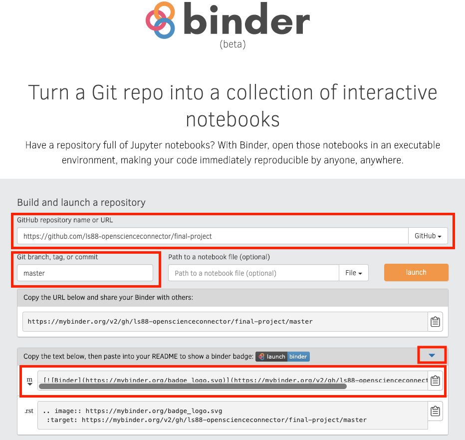

# L&S 88 - Final Project [Sample] - Insurance Charges & Smoking Habits

_Chris Pyles, [other team members]_

[](https://mybinder.org/v2/gh/ls88-openscienceconnector/final-project/master)

This project for L&S 88 attempts to recreate the analysis by Chris Pyles in his notebook which analyzes an insurance data set from Kaggle. The purpose of this project is to attempt to reproduce the findings in the original analysis regarding the relationship between smoker status and insurance charges. We will also evaluate the efficacy and reliability of this data set to qualify any conclusions that we draw. For more detailed information, see our [Pre-Analysis Plan](notebooks/pre-analysis-plan.ipynb).

## Directory Structure

This repo contains a few subfolders which contain the elements of this project.

| Folder | Description |
|-----|-----|
| `data`  | data from the original analysis in CSV, TSV, and pip-separated format  |
| `images`  | image files used in the Jupyter Notebooks  |
| `notebooks`  | Jupyter Notebook files, including reproduction analysis using both `pandas` and `datascience`, as well as the Pre-Analysis Plan and a "blank" notebook  |
| `output`  | output data (same as original, for demo purposes) in CSV and TSV format  |
| `subassignments`  | Markdown files with submissions for final project sub-assignments  |

## Final Project Details

Your repo should contain _all_ of the folders listed above, and they should contain the appropriate files (e.g. the notebook with your analysis goes into the `notebooks` folder).

### Pre-Analysis Plan

This should be completed after you have your data set but before you begin your analysis. **Make sure to timestamp this document!** This is the whole point of a Pre-Analysis Plan. It should contain the following sections:

| Section | Description |
|-----|-----|
| Abstract  | an abstract for your project, excl. findings  |
| Data  | description of your data set (something akin to a synthesis of the Step 1 assignment)  |
| Strategy  | an outline of the steps you will take to analyze your data (mostly a description of the code)  |
| Analysis  | any heuristics or mathematical models that you use, and the reasons for their use  |
| Deliverables  | a description of the deliverable files in the repo, incl. where your presentation is  |
| Sources   | list of sources for your data _and any other research_ that you did  |

### MyBinder

You should note that this repository has a MyBinder link (at the top of this README) which links to MyBinder to allow others to run our code. _Your repository should also include such a link._ The steps to create this link are given below:

1. Copy the `requirements.txt` file from this repo and add it to yours. This should cover all dependencies, but if you use any that are not listed in that file, _make sure to add them_.
2. Go to the [MyBinder website](https://mybinder.org/) and paste the URL to your repo in the `GitHub repository name or URL` field (pictured below).
3. Include the brach name in the `Git branch, tag, or commit` field; for most, this will be `master`.
4. Open the dropdown below the Binder URL and copy the text next to the .
5. Paste this text into your README right below where your names are listed at the top. For our repo, it looked like this:

```markdown
[](https://mybinder.org/v2/gh/ls88-openscienceconnector/final-project/master)
```

Here is a screenshot of the website filled out for this repo:



### Github Best Practices

Note that this repository has a README and that each subfolder (except for the `images` folder) has a README as well. This should be reflected in the repo that you submit.

Make sure that your files render properly in Github. For example, Github does not render the LaTeX `\limits` command, and any display math that uses it will not be rendered.

**License:** Your repository should have a license on it. For most, if not all, of you, this will be a CC0 license, however we leave it at your discretion to choose the license for your project. Because Github no longer lists the CC0 template in its template chooser, we provide a link below to load this template into your repository. To use it, simply replace `<repo>` with the name of your repository.

> `https://github.com/ls88-openscienceconnector/<repo>/community/license/new?branch=master&template=cc0-1.0`

### Deliverables

Your project should have some deliverable (e.g. PDF, PPT, data). These should be uploaded in the `output` folder of your repo. If it is not a file you can upload (e.g. a Google Slides presentation), it should be linked-to in the README for that folder (even if this means you have a folder that is empty except for a README).

## Sources

Lantz, Brett. _Machine Learning for R_. Packt, 2013. [https://edu.kpfu.ru/pluginfile.php/278552/mod_resource/content/1/MachineLearningR__Brett_Lantz.pdf](https://edu.kpfu.ru/pluginfile.php/278552/mod_resource/content/1/MachineLearningR__Brett_Lantz.pdf).

Medical Cost Personal Datasets. Kaggle. 2019. [https://www.kaggle.com/mirichoi0218/insurance](https://www.kaggle.com/mirichoi0218/insurance).

Pyles, Chris. Insurance Data. Github. 12 March 2019. [https://github.com/chrispyles/jupyter/blob/master/content/notebooks/insurance/insurance.ipynb](https://github.com/chrispyles/jupyter/blob/master/content/notebooks/insurance/insurance.ipynb).
